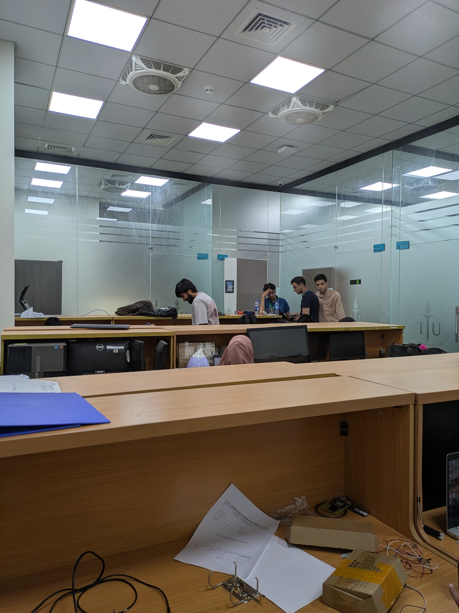

# Custom Sensor Domain Adaptation Pipeline for SYENET

This repository contains the software architecture and zero-shot domain adaptation pipeline designed to deploy the lightweight [SYENET ISP](https://github.com/sanechips-multimedia/syenet) on custom, real-world camera hardware (Google Pixel 7a).

---

## Hardware Mismatch & The Challenge

AI-based Image Signal Processors (ISPs) are highly sensor-specific. SYENET was trained on the MAI dataset (Mediatek/Fujifilm sensors), which expects raw data formatted precisely as:
* **12-bit depth** (Max value 4095)
* A strict hardware **black-level noise floor** of ~344.

**Our Hardware (Google Pixel 7a Sony IMX787):**
* **14-bit depth** (Max value 16383)
* A native **black-level of 0**.
* A strong native **blue-tint** color profile.

Feeding Pixel 7a data directly into the AI results in mathematical overflow, highlight clipping, and severe color corruption.

---

## Evolution of Domain Adaptation (Ablation Study)

To scientifically validate our preprocessing, we iteratively engineered a mathematical pipeline to seamlessly translate the Pixel 7a hardware physics into the exact profile the AI expects, without retraining a single weight in the neural network.

**Methodology:** The color and exposure multipliers were derived through empirical optimization (grid search). We ran iterative inference loops across a subset of images, slightly adjusting the color scalars, and continuously calculating the resulting PSNR against the Ground Truth. We locked in the final values when the PSNR reached its absolute mathematical peak.

Here is the step-by-step evolution of our pipeline:

| Target Ground Truth |
| :---: |
|  |

### Step 1: Raw 14-bit Data (No Adaptation)
Passing 14-bit (16383) data directly into the 12-bit (4095) AI causes massive mathematical overflow, resulting in a completely destroyed pink/magenta image.


### Step 2: Bit Scaling Only (No Black Level)
We mathematically compressed the 14-bit data down to 12-bit. The overflow is fixed, but the contrast is completely wrong and washed out because the AI expects absolute black to start at `344`, but our sensor provides `0`.


### Step 3: Bit Scaling + Black Level Injection (No Color Nudges)
By analyzing the MAI dataset's noise floor, we determined the AI expects absolute black to begin at `344`. We manually injected a baseline value of `+344` to every pixel to simulate the exact "noise floor" the SYENET expects. The contrast is now perfect, but the image suffers from the Pixel 7a's native blue hardware tint.


### Step 4: Optimal Preprocessing (Our Final Pipeline)
We applied a global brightness boost (`1.20x`) and specific white-balance multipliers (Red: `1.118`, Green: `1.042`, Blue: `0.943`) to neutralize the blue tint and mimic the AI's training data.


**FINAL RESULT:** 12.73 dB PSNR

---

## Quick Start Guide

### 0. Download the Dataset
The complete Google Pixel 7a Custom Dataset (14-bit RAW inputs, RGB Ground Truths, and SYENET Processed outputs) is hosted externally. 
[🔗 Download SYENET_Pixel7a_Custom_Dataset here](https://drive.google.com/drive/folders/1XHF59HnqhQiPCTLFdz6z6k-wkiPBaQ70?usp=sharing)

### 1. Setup Dependencies
```bash
pip install rawpy numpy torch Pillow
```

### 2. Clone the official SYENET Repository
Because we do not claim the underlying model architecture, please clone the official Sanechips repository directly into this folder:
```bash
git clone https://github.com/sanechips-multimedia/syenet.git
```

### 3. Request Pre-trained Weights
The `model_best_slim.pkl` weights file is required to run inference. Please email `BSCE220029@itu.edu.pk` to request the weights, ensuring that you keep `BSCE22007@itu.edu.pk` and `BSCE220035@itu.edu.pk` in CC. 

In your email, please explicitly include:
* Your full name and occupation.
* Your affiliated organization (e.g., University or Company).
* The purpose for requesting the model weights.

Once approved and received, place the file in the `weights/` directory.

### 4. Run the Inference Pipeline
This script automatically applies the full Domain Adaptation, runs the AI, extracts the physical gravity `flip_val` from the EXIF data, rotates the image upright, and saves it.
```bash
python 1_preprocess_and_infer.py path/to/your/image.dng
```

### 5. Evaluate Mathematical Metrics
This script automatically aligns the output image with the Ground Truth using Lanczos Resampling (to ensure pixel-perfect geometric alignment) and calculates absolute PSNR and SSIM.
```bash
python 2_evaluate_metrics.py path/to/processed_output.png path/to/ground_truth.jpeg
```
